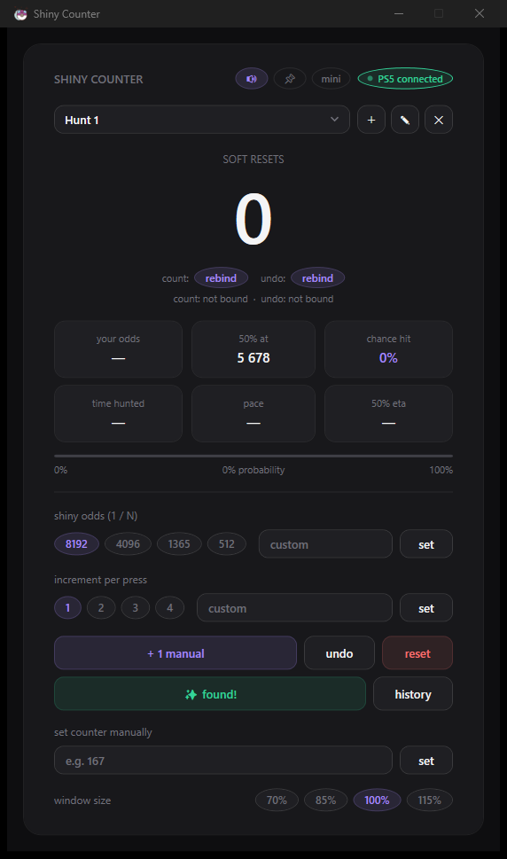
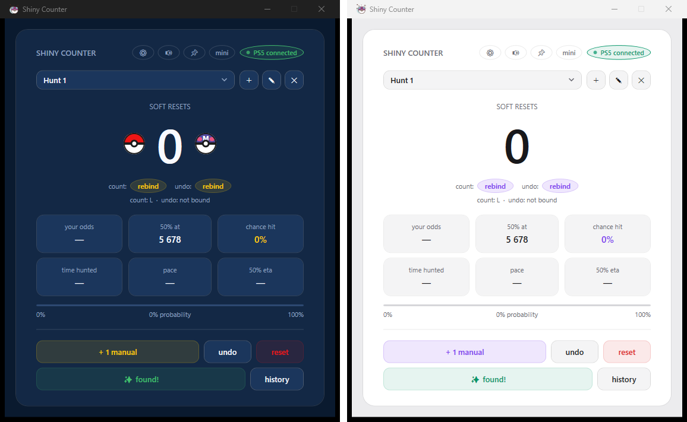

# ✨ Shiny Counter

A native Windows counter for Pokémon shiny hunting. Bind a keyboard key or a controller button and it counts your soft resets **even while your game has focus** — no alt-tabbing, no browser tab that has to stay active.

<p align="center">
  
</p>

## Features

- **Global triggers** — bind any keyboard key or controller button (PS5 DualSense, Xbox, and most other controllers). Counts register while your game, emulator, or capture software is focused. A second bindable trigger undoes miscounts.
- **Multiple hunts** — track several targets at once, each with its own count, odds, step size, bindings, and timer.
- **Live odds math** — pick your shiny odds (1/8192, 1/4096, 1/1365 charm, 1/512, or custom) and see your cumulative chance, the 50% mark, and a probability bar.
- **Pace & ETA** — tracks active hunting time (AFK gaps don't count), your resets per hour, and the estimated time until you pass 50% odds.
- **Mini overlay** — shrink to a tiny always-on-top counter that sits in a screen corner over your game.
- **Hunt history** — hit *✨ found!* when you get the shiny and the hunt is archived with its count, odds, time, and date.
- **Themes** — Dark, Light, and Pokémon built in, switchable in settings. Community themes are simple JSON files: drop one into `%APPDATA%\ShinyCounter\Themes` and it appears in the picker.
- **Settings window** — sound, window size, theme, triggers, odds, and step all in one tidy ⚙ panel.
- **Quality of life** — tick sound on each count, always-on-top pin, window size presets (70–115%), increment steps for multi-encounter methods, autosave to `%APPDATA%\ShinyCounter`.

<p align="center">
  
</p>

## Download

Grab `ShinyCounter.exe` from the [latest release](../../releases/latest) and run it. No install, no dependencies.

> **Note:** Windows SmartScreen may warn on first run because the exe isn't code-signed (signing certificates cost money — this is a free hobby project). Click *More info → Run anyway*.

## Usage

1. Click **rebind** next to *count:* and press the key or controller button you use for soft resets.
2. Play your game. Every press counts, even with the game focused.
3. Optional: bind an undo trigger, pick your odds, pin the window, or switch to **mini** overlay mode.

## Making a theme

Themes are JSON files with 12 colors — hover/dim/border shades are derived automatically. Copy a stock file from `%APPDATA%\ShinyCounter\Themes`, **rename it** (stock files are refreshed on every launch), change the colors, then pick it in ⚙ settings. Add `"Decor": "pokeballs"` to show the Pokéball and Masterball beside the counter, like the Pokémon theme does:

```json
{
  "Name": "MyTheme",
  "Colors": {
    "bg": "#0E0E10", "surface": "#18181B", "surface2": "#1F1F23",
    "border": "#14FFFFFF", "borderHover": "#26FFFFFF",
    "text": "#F4F4F5", "muted": "#71717A", "hint": "#3F3F46",
    "accent": "#A78BFA", "danger": "#F87171", "success": "#34D399", "warning": "#FBBF24"
  }
}
```

Made a good one? Open a PR or issue and it can be featured here.

## Building from source

Requires the [.NET 8 SDK](https://dotnet.microsoft.com/download/dotnet/8.0).

```powershell
dotnet publish ShinyCounter/ShinyCounter.csproj -c Release -r win-x64 --self-contained true -p:PublishSingleFile=true -p:IncludeNativeLibrariesForSelfExtract=true -o out
```

WPF, .NET 8, no third-party packages. Controller input via `Windows.Gaming.Input`, global keybinds via a low-level keyboard hook (listen-only — keystrokes are never blocked or modified).

## Support

Shiny Counter is free and always will be. If it helped you land a shiny, you can [buy me a coffee](https://buymeacoffee.com/emilianovec) ☕ — totally optional.

## License

[MIT](LICENSE)
